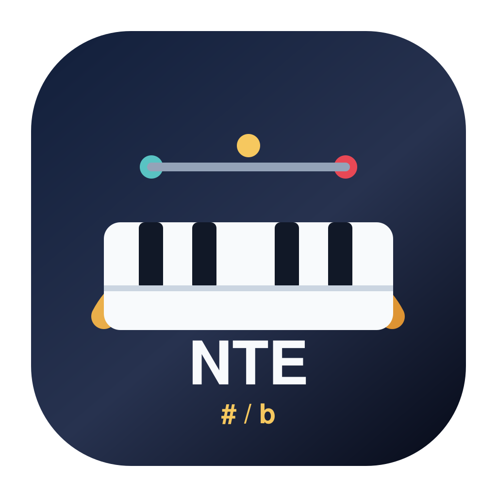
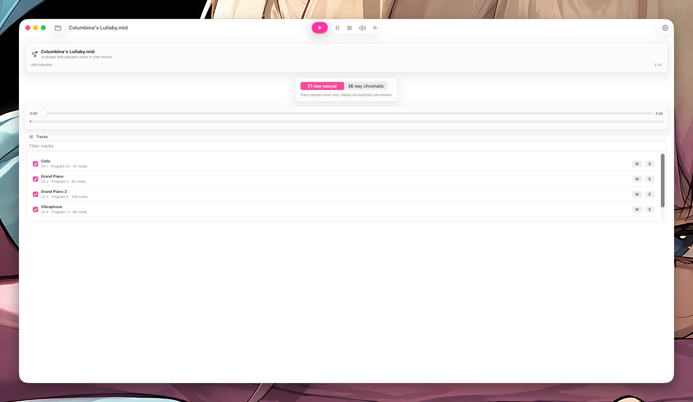
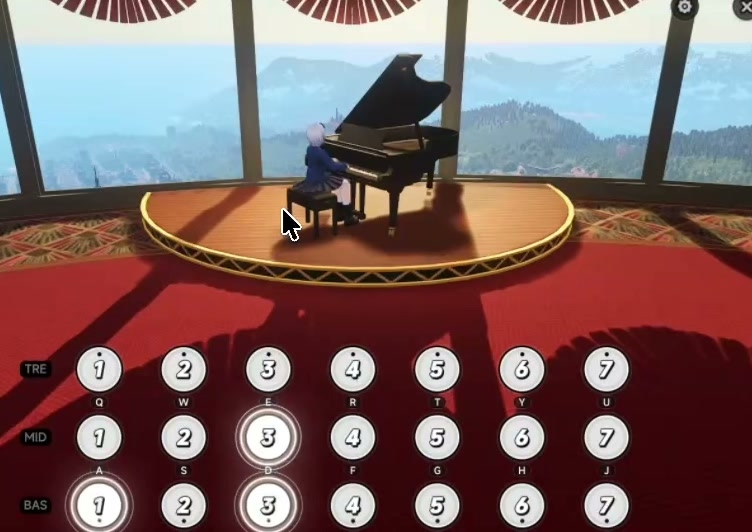
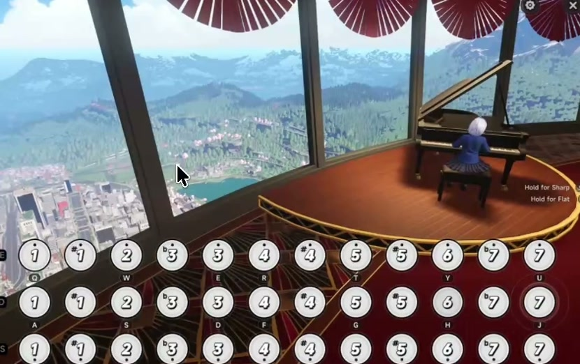

# NTE Piano MIDI Player

<p align="center">
  
</p>

NTE Piano MIDI Player is a native macOS app that turns Standard MIDI files into keyboard input for the in-game piano in Neverness to Everness (NTE). It is built in Swift and SwiftUI, supports NTE's 21-key natural and 36-key chromatic layouts, and can preview a song before sending any input to the game.

**Requires macOS 26.0 or later.**



> [!NOTE]
> I do not have a background in music theory. If something sounds off, it may be a limitation of NTE's available piano range, a MIDI file that is too complex to reduce cleanly, or a mapping issue in the app. Issues and pull requests are welcome.

## Download and install

NTE Piano MIDI Player is distributed as an unsigned and unnotarized app.

1. Download the latest `NTE-Piano-MIDI-Player-macOS-unsigned.zip` from [GitHub Releases](https://github.com/Kusanalee/NTE-Piano-MIDI-Player/releases/latest).
2. Unzip it and move **NTE Piano MIDI Player.app** to `/Applications`.
3. Try to open the app once.
4. If macOS blocks it, open **System Settings → Privacy & Security**, find the message about NTE Piano MIDI Player, and select **Open Anyway**.

If Gatekeeper still reports that the app is damaged or cannot be opened, remove the quarantine attribute in Terminal:

```sh
xattr -dr com.apple.quarantine "/Applications/NTE Piano MIDI Player.app"
open "/Applications/NTE Piano MIDI Player.app"
```

Only use that command for a copy downloaded from this repository's official Releases page or built locally from source you reviewed. If the app is somewhere other than `/Applications`, update both paths.

## Quick start

The Setup Assistant opens on first launch and can be run again from **Help → Setup Assistant**.

1. Choose whether to set up 36-key chromatic playback or skip the driver and use 21-key natural playback.
2. Open or drag a `.mid` or `.midi` file into the app.
3. Use **Listen** if you want to hear the original MIDI through your speakers first.
4. Press **Play**.
5. During the countdown, switch to NTE and open the in-game piano.

Track enable, mute, solo, and Listen controls stay on the main window. Arrangement mode, transpose, layout, timing, manual key mapping, Preview Mode, and diagnostics are available under **Settings → Enable Advanced Developer Settings**.

Preview Mode performs the complete arrangement without sending keyboard input, which is useful for checking a complex or input-heavy file before using it in-game.

## Demo videos

Demo videos and screenshots are for illustrative purposes only and may not reflect the latest version of the application.

### 21-key natural mode — in-game demo

[](https://github.com/user-attachments/assets/6fa1433e-bdae-4f38-a48a-de1f5a2a7db3)

[Watch the 21-key demo with audio](https://github.com/user-attachments/assets/6fa1433e-bdae-4f38-a48a-de1f5a2a7db3)

### 36-key chromatic mode — in-game demo

[](https://github.com/user-attachments/assets/2521ef8e-53aa-4931-8e45-697657d7a3ea)

[Watch the 36-key demo with audio](https://github.com/user-attachments/assets/2521ef8e-53aa-4931-8e45-697657d7a3ea)

## Why 36-key mode needs VirtualHID

NTE's 21-key layout uses only the 21 letter keys, so the app can send those through macOS's Quartz/CoreGraphics input system after you grant Accessibility permission.

The 36-key layout adds sharp and flat layers controlled by left Shift and left Control. NTE does not reliably accept the synthetic modifier state normally sent by macOS apps, so Quartz alone cannot reproduce that layout correctly. For 36-key playback, NTE Piano MIDI Player sends complete hardware-style keyboard reports through Karabiner's DriverKit VirtualHIDDevice and the app's authenticated local bridge.

Either of these installations is supported:

- the standalone [Karabiner DriverKit VirtualHIDDevice package 8.2.0](https://github.com/pqrs-org/Karabiner-DriverKit-VirtualHIDDevice/releases/tag/v8.2.0), which contains driver 1.8.0; or
- a compatible full [Karabiner-Elements](https://karabiner-elements.pqrs.org/) installation containing the same VirtualHID driver.

The Setup Assistant detects either installation, activates the extension, and can install the required background services with one administrator prompt. It does not replace or modify an existing Karabiner-Elements service. You can remove only this app's helper services later from **Settings → General → Setup**.

The bridge runs with elevated privileges because the upstream driver requires it, but it accepts only one authenticated local user and only the 21 piano letters, left Shift, and left Control. It releases the virtual keyboard on disconnect or heartbeat timeout. There is no silent Quartz fallback when 36-key VirtualHID is unavailable.

### Playback requirements

| Mode | Runtime requirement | Notes |
| --- | --- | --- |
| 21-key natural | Accessibility permission | Uses Quartz/CoreGraphics and does not require VirtualHID. |
| 36-key chromatic | VirtualHID package 8.2.0 / driver 1.8.0, or compatible Karabiner-Elements | Uses hardware-style letter and modifier reports. Accessibility is not required for playback itself. |
| Preview, MIDI inspection, Listen, and sheet export | None of the above | These features do not send input to NTE. |

## Features and limitations

### Features

- Automatic best-effort arrangement for NTE's limited range and input budget
- 21-key natural and 36-key chromatic layouts
- Track search, enable, mute, and solo controls
- Speaker preview through `AVMIDIPlayer`
- Configurable countdown, tempo, appearance, and Liquid Glass opacity
- Pause, resume, progress, keyboard preview, and range diagnostics
- Manual keyboard remapping and modifier calibration
- Piano-sheet export with note names, degrees, key labels, wrapping, and chord brackets
- Persistent settings and recent files

### Arrangement behavior

**Automatic** is the default. It applies tempo and sustain information, omits General MIDI percussion channel 10, groups nearby onsets into chords, evaluates bounded transpositions, fits wide ranges by octave, and reduces notes that cannot fit NTE's physical or timing limits. In 36-key mode it can roll a slow cross-layer chord exactly when there is enough time; otherwise it keeps higher-priority exact notes and omits incompatible tones rather than moving them by a semitone.

**Original** is a diagnostic comparison path. It retains the selected tracks, including channel 10, and bypasses automatic global fitting and musical reduction where possible. It must still obey the chosen NTE layout, range, layer, collision, and simultaneous-key limits because the game cannot reproduce impossible input.

### NTE keyboard layouts

All three rows use the same seven physical positions:

| Row | Keys |
| --- | --- |
| TRE | `QWERTYU` |
| MID | `ASDFGHJ` |
| BAS | `ZXCVBNM` |

The 21-key layout assigns C, D, E, F, G, A, and B to each row without modifiers.

The 36-key layout adds these layers:

| Layer | Notes on each row |
| --- | --- |
| No modifier | C, D, E, F, G, A, B |
| Left Shift | C#, D, E, F#, G#, A, B |
| Left Control | C, D, Eb, F, G, A, Bb |

The effective 36-key limit is six notes per source onset, including notes split across an exact roll. The scheduler releases letter keys before changing modifier layers and releases every held key on stop, focus loss, cancellation, completion, disconnect, or error.

### Known limitations

- NTE cannot reproduce arbitrary MIDI ranges, velocity dynamics, pitch bends, aftertouch, or every expression event.
- Dense passages and cross-layer chords may be octave-folded, rolled, merged, deduplicated, or reduced.
- A MIDI written for many instruments may need tracks disabled before it produces a useful solo-piano arrangement.
- Live MIDI input, playlist polish, and a system-wide emergency hotkey are not currently supported.
- Releases are unsigned and unnotarized, so macOS approval may be required after each download.

## Platform support

There are no plans to port NTE Piano MIDI Player to Windows, Linux, mobile devices, or consoles.

Windows users can instead look at [Jed556/AutoMidiPlayer](https://github.com/Jed556/AutoMidiPlayer), a separate project that supports NTE and other in-game instruments.

## Safety disclaimer

**Can using this get an account penalized? The honest answer is uncertain. Use it at your own risk.**

Automation may violate NTE's rules or terms, and no statement in this repository guarantees that using the app is permitted or undetectable. Listen to or preview a MIDI first, avoid files that spam excessive keyboard input, and enable only the tracks you actually need.

The app does not read game memory, modify the game, bypass anti-cheat, or attempt to hide its input automation. That does not mean the game will consider it authorized. NTE's official privacy policy describes [data collected to prevent cheating and unauthorized software](https://static.pwsdk.com/nte/privacy/privacy.html), including monitoring for suspected unauthorized programs, files, and processes. Review that disclosure before deciding whether to use this or any other automation tool.

Live playback is restricted to the configured foreground app names, which default to:

- `NTE.app`
- `NTE`
- `Neverness to Everness`

## Build from source

### Requirements

- macOS 26.0 or later
- Git
- Xcode with the macOS 26 SDK
- The repository's recursive Git submodules

Clone the repository and its pinned VirtualHID dependency:

```sh
git clone --recurse-submodules https://github.com/Kusanalee/NTE-Piano-MIDI-Player.git
cd NTE-Piano-MIDI-Player
```

If you already cloned without submodules, initialize them with:

```sh
git submodule update --init --recursive
```

Open `NTEPianoMidiPlayer.xcodeproj` and use the shared **NTEPianoMidiPlayer** macOS scheme, or run the command-line checks:

```sh
xcodebuild \
  -project NTEPianoMidiPlayer.xcodeproj \
  -scheme NTEPianoMidiPlayer \
  -destination 'platform=macOS' \
  CODE_SIGNING_ALLOWED=NO \
  test

xcodebuild \
  -project NTEPianoMidiPlayer.xcodeproj \
  -scheme NTEPianoMidiPlayer \
  -configuration Release \
  -destination 'platform=macOS' \
  CODE_SIGNING_ALLOWED=NO \
  build
```

To create the unsigned application and release ZIP:

```sh
scripts/build_app.sh
```

The packaging script writes:

- `dist/NTE Piano MIDI Player.app`
- `dist/NTE-Piano-MIDI-Player-macOS-unsigned.zip`

## Contributing

Issues and pull requests are welcome, especially for note mapping, arrangement quality, MIDI compatibility, setup clarity, accessibility, and reproducible bugs.

When reporting a problem, include the layout and arrangement mode you used, the relevant diagnostics, and a small redistributable MIDI example when possible. Please do not commit copyrighted or private MIDI files without permission.

Before opening a pull request:

1. Keep existing 21-key and 36-key behavior stable unless the change explicitly targets it.
2. Add or update tests for behavior changes.
3. Run the test suite, an unsigned Release build, and `git diff --check`.
4. Describe what was tested automatically and what, if anything, was verified live in NTE.

## License

NTE Piano MIDI Player is free software licensed under the [GNU General Public License v3.0](LICENSE).

This project is not affiliated with or endorsed by Hotta Studio. Neverness to Everness and related names, logos, and game assets belong to their respective owners.
